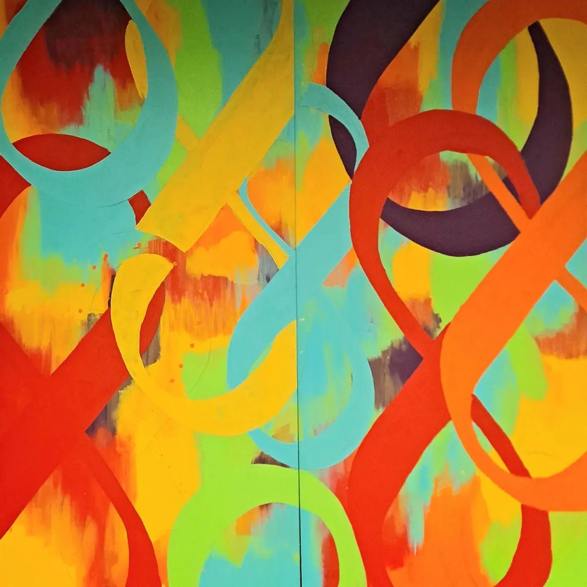
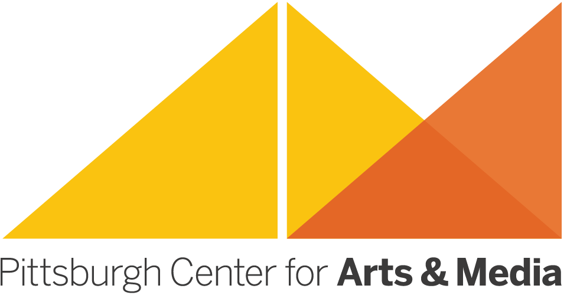
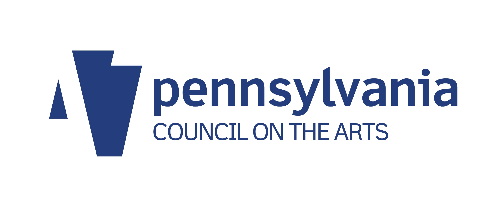
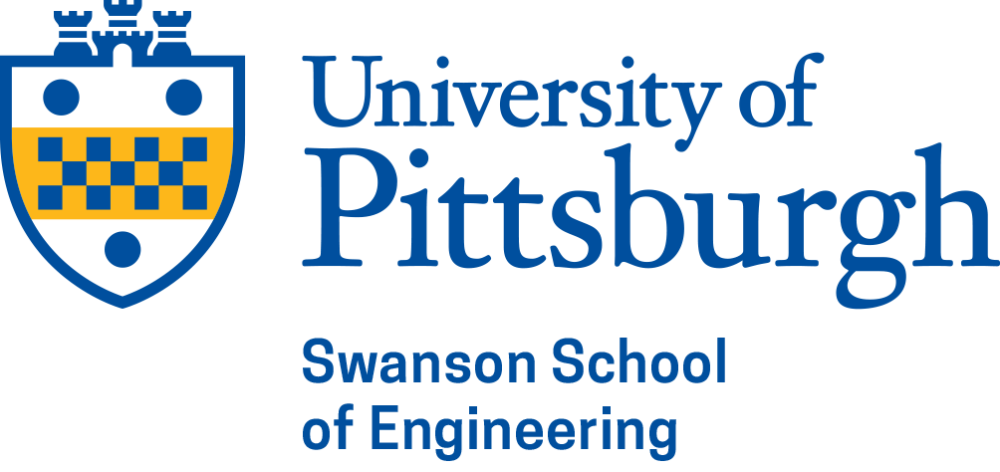
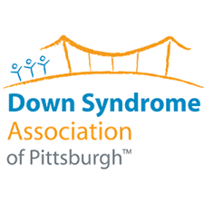

  

    <blockquote class="blockquote mb-0 text-center computer-modern">
      
“Diversity and inclusion, which are the real grounds for creativity, must remain at the center of what we do.”

      <footer class="text-end">
      </footer>
    </blockquote>
  

|{: .w-100 .img-thumbnail}|
| :-----------------------------------------------------------------------------------------------------------: |
|                                              **Collaborating Communities**                                              |
{: .mx-auto .mb-0 .w-50}
In 2022, the Special Needs Assistance Program for Social Engagement was created with aims of increasing the engagement, awareness, and communication between the neurodiverse and neurotypical people. SNAP sought out to create opportunities to bring both groups together to create a stronger bond and better understanding of each other. Since our founding, we've worked with numerous neurodiverse organization to engage our members and the community in activities to promote inclusivity bonding.

Recently, SNAP partnered with the Pittsburgh Center for Art and Media (a non-profit organization that focuses on using art to bring the Pittsburgh community together) and artist Alison Zapata to help create a mural on Pitt's campus. The mural, designed by Alison Zapata, is inspired by the neurodiversity sign and signifies a path towards a more inclusive environment.

The mural was created by a mix of 16 Pitt students and 16 neurodiverse volunteers who worked in collaboration to stencil and paint it.

## Contributors
{:.text-center}

Allison Zapata  
Aditi Choudhary  
Anna Ligorio  
Ashley Sabia  
Elizabeth Holmes  
Isabella Alba  
Jenna Toth  
Joshua Merritt  
Lydia Wayman  
Maanas Matlapudi  
Maria Leon  
Maria Palmer   

Maria Rajakovich  
Mary Stanton  
Nathan Fligelman  
Nellia Kostadinova  
Sam and Larry Miller  
Sarah Truitt  
Shinwoo Kim  
Sreeveda Sreepada  
Thana McLain  
Tori Morris  
Zachary Miller  

Not seeing your name here? Please [contact us](/contact/) so that we can fix it!
{: .text-center}

## Sponsers & Partners

[{: .sponser}](https://www.arts.pa.gov/)
[{: .sponser}](https://pghartsmedia.org/)

{:.text-center}
This mural was created by SNAP@Pitt and members from its partnering organizations during an Artist Residency Project led by Visual Artist/Teaching Artist [Alison Zapata](https://zapatastudios.com/). This project was supported in part by the Arts in Education (AIE) Partnership of the [Pennsylvania Council on the Arts](https://www.arts.pa.gov/Pages/default.aspx), a state agency, and the [National Endowment for the Arts](https://www.arts.gov/), a federal agency. The AIE Partner serving *Allegheny*, *Beaver*, *Greene*, and *Washington counties* is [Pittsburgh Center for Arts and Media](https://pghartsmedia.org/).

Additional project funding and support was provided by: 

[{: .sponser}](https://www.engineering.pitt.edu/)
[{: .sponser}](https://autismofpa.org/)
[{: .sponser}](https://www.achieva.info/)
[{: .sponser}](https://www.dsapgh.org/)
[{: .sponser}](https://www.emmauspgh.org/)

Thank you for your support!

