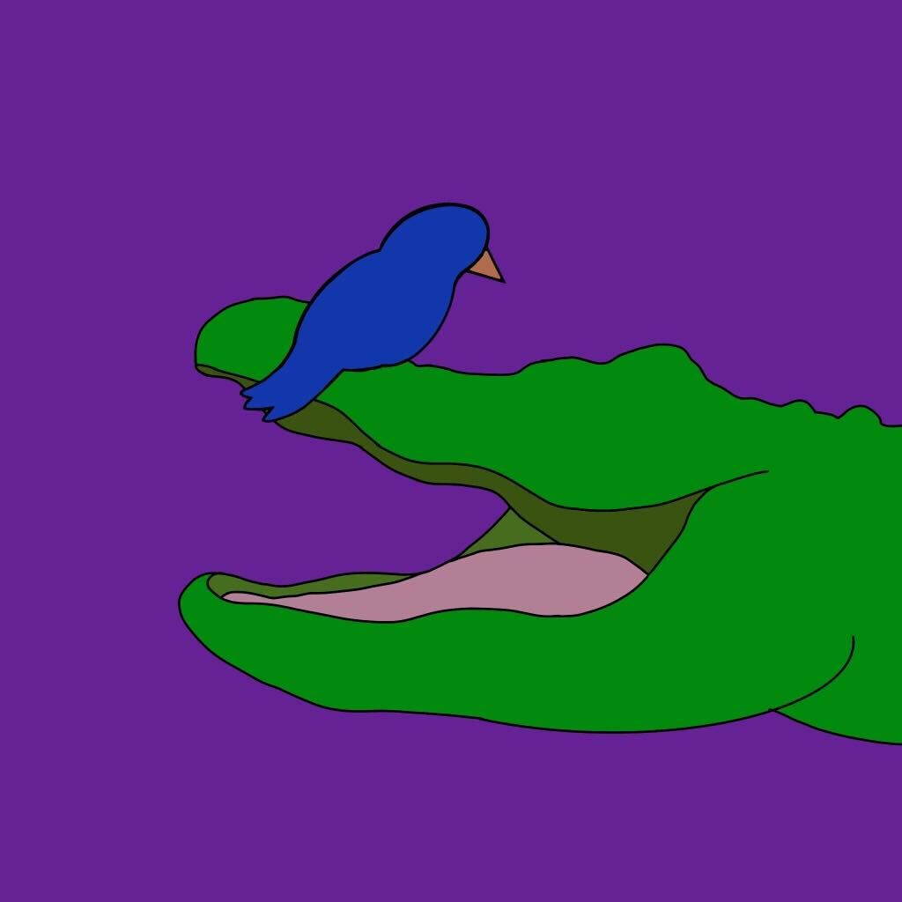

    
    <figcaption class="text-center"><b>Zachary Miller</b>, <em>Founder & President</em></figcaption>

 
I have been surrounded by and supported by the special needs community. From my experiences, they are a close-knit group of individuals that deeply care for one another and show so much unconditional love and compassion without any judgment. My brother and sister were diagnosed with autism spectrum disorder at a young age, and as the middle child, I have seen all aspects of the struggles in neurodiverse adolescence. My parents and I will commonly discuss different ways to help my brother and sister with their struggles whether it be academic, work, or social. As a reminder, the simplest tasks to a neurotypical kid may be the largest wall to get around for a neurodiverse child. In one of these discussions, my mother and I were conversing about my sister Addison’s social life. Addison has always been the social butterfly of the family. She wants to talk to anyone who’s willing to and is always looking to strike up a conversation and make new friends. In neurodiverse situations, this works great because there is no judgment, and Addison's peers understand her as does she. Unfortunately, in a more neurotypical-based world, there is more judgment toward those who do not act in the typical social norms. My sister's entire life has been searching for friends in school, but it is extraordinarily difficult when her peers in the classroom may not understand or accept her. Because of my love for the special needs community, I was already considering creating a program that would allow for greater interactions between the neurodiverse and neurotypical communities. As the founder of Zachary Miller’s Tutoring for Math and Science, I wanted to create a tutoring service where neurodiverse children are tutored by neurotypical adolescents. After having that initial conversation with my mom, I realized that there is even more of a need to make a linking bridge between the two communities. More than academics and work, both communities need an avenue of connecting. The Special Needs Assistance Program for Social Engagement, abbreviated to SNAP for short, was thus formed to give students a stronger platform and gateway between the two worlds; to give both sides a more accessible way to meet new friends.

    

<h1 class="text-center">Our Mission</h1> 

> _To allow for greater communication within the neurodiverse community and give greater opportunities for new neurodiverse and neurotypical interactions._

    <iframe src="https://player.vimeo.com/video/729478923?h=4222d11d7a&amp;badge=0&amp;autopause=0&amp;player_id=0&amp;app_id=58479" frameborder="0" allow="autoplay; fullscreen; picture-in-picture" allowfullscreen style="position:absolute;top:0;left:0;width:100%;height:100%;" title="SNAP Pitch">
    </iframe>

    <a class="btn btn-primary" href="{{site.baseurl}}/projects">Learn More About What We're Doing</a>

<h1 class="text-center">Our Logo</h1> 

In nature, birds and alligators live in a harmonious relationship called mutualism. The biological, symbiotic relationship where two animals benefit one another. The bird will rest inside the alligator’s mouth and pick out any of the food remains in the alligator’s teeth. This feeds the bird and keeps the alligator’s mouth nice and clean. SNAP adapts this ideology to neurodiverse and neurotypical individuals. There is a uniqueness to our relationships, but something so unique and significant in that we can help one another and grow together. SNAP’s logo shows the love and supports the two communities should share and will continue to develop and advocate.